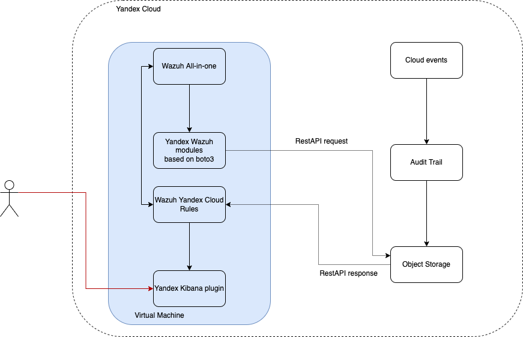
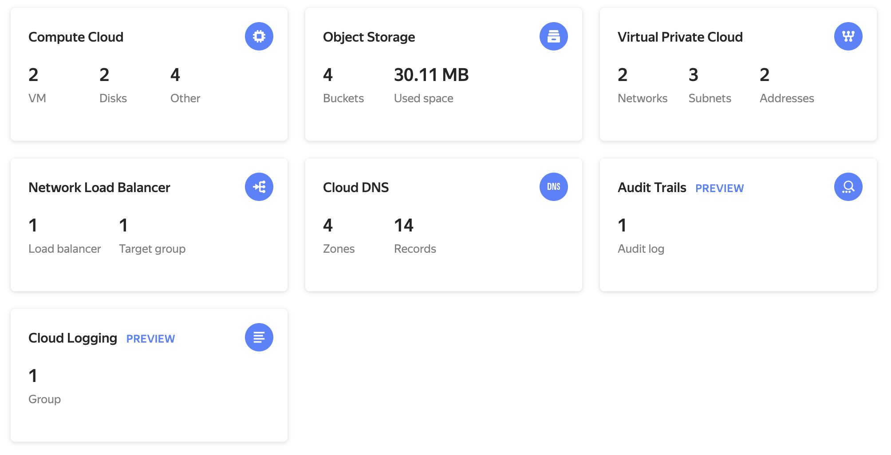
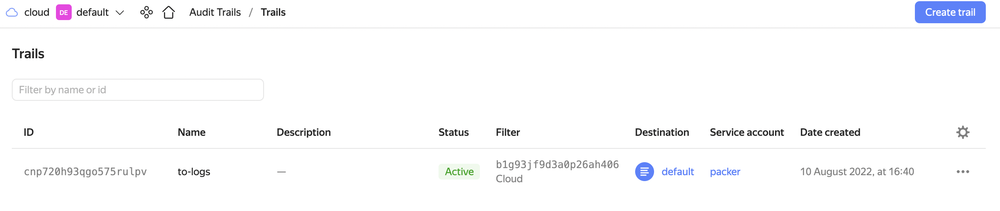
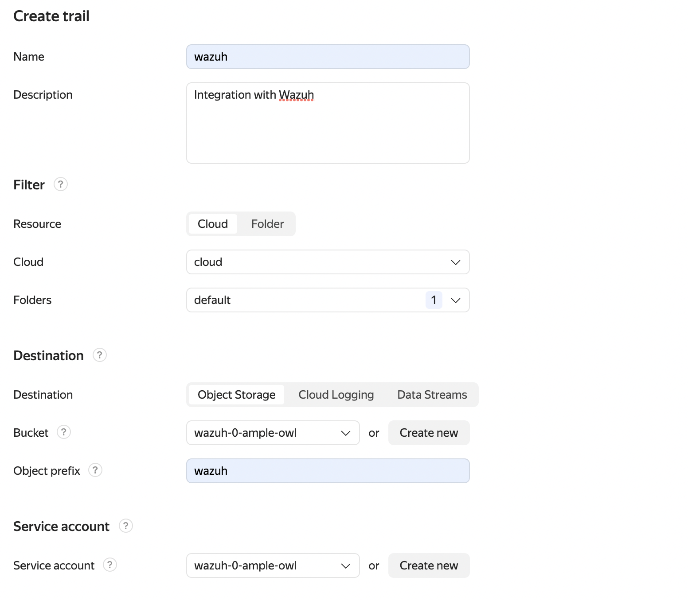
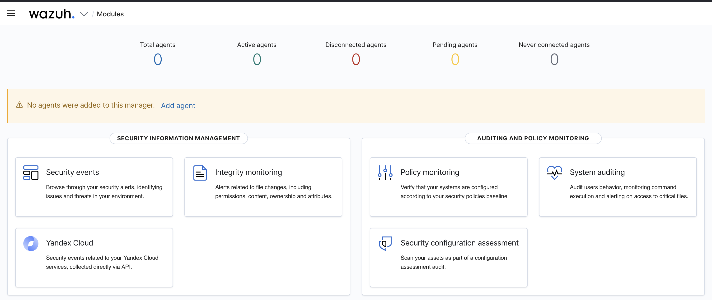
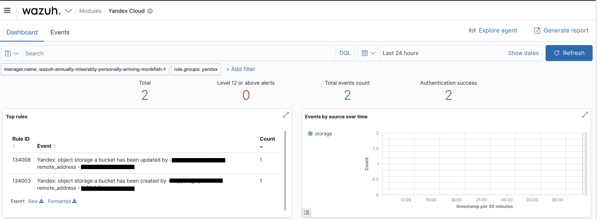
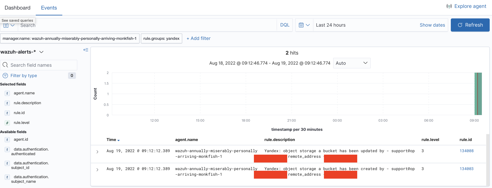
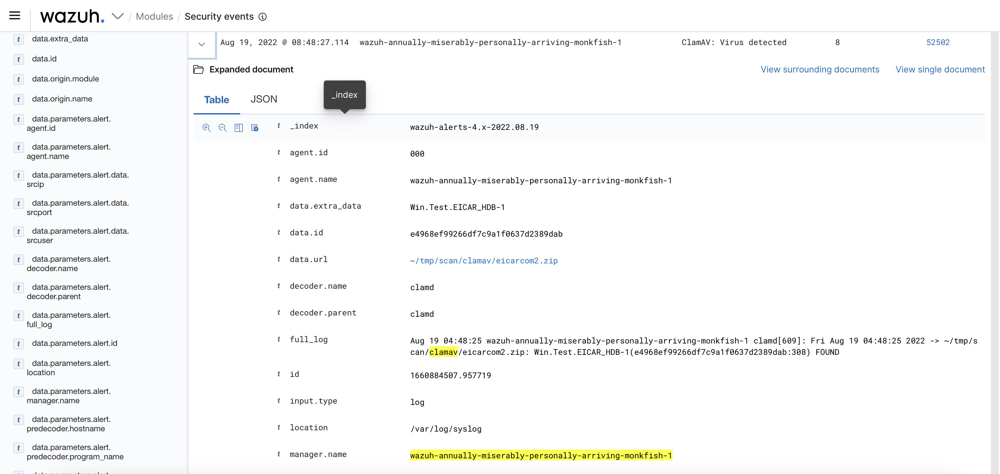

## Integrating Yandex Cloud with Wazuh

Here is an example of how you can integrate [Wazuh](https://wazuh.com/) and Yandex Cloud to analyze [Yandex Audit Trails](https://yandex.cloud/en/docs/audit-trails/).

Before implementing the integration, follow this brief checklist below.

You will need:

 - [Yandex Audit Trails](https://yandex.cloud/en/docs/audit-trails/)
 - Terraform 1.1.3 or higher
 - Packer 1.7.8 or higher
 - `YC_FOLDER_ID` and `YC_TOKEN` 

## Preparing your image

Before creating your infrastructure, build a new [image](https://yandex.cloud/en/docs/compute/concepts/image) with [Packer](https://www.packer.io/plugins/builders/yandex).

First, switch to the directory:

```shell
cd packer
```

The base configuration will include two _wodles_ (Wazuh packages) in the build: one for integrating with Yandex Audit Trails, the other, for scanning [Yandex Object Storage](https://yandex.cloud/en/docs/storage/) for malware with [ClamAV](https://www.clamav.net/).

### Main variables for the Ansible role

## Ansible variables

`packages_to_install`: List of packages to install:

```yanl
packages_to_install:
    - python3-pip
    - awscli
    - apt-transport-https
    - curl
    - lsb-release
    - unzip
    - wget
    - libcap2-bin
    - software-properties-common
    - gnupg2
    - net-tools
    - htop
```

`pip_packages_to_install`: List of Python packages to install on your system:

```yaml

pip_packages_to_install:
    - docker==4.2.0
    - boto3
```

`wazuh_pip_packages`: List of Python packages to install for the internal framework:

```yaml

wazuh_pip_packages:
    - clamd
```

`clamav_packages`: List of packages for ClamAV integration:

```yaml
clamav_packages:
    - clamav-daemon
    - clamav-freshclam
    - clamav
```

`wazuh_version`: Wazuh version:

```yaml
wazuh_version: "4.3"
```

`yandex_wazuh_app_url`: URL for the Kibana app:

```yaml

yandex_wazuh_app_url: "https://artifacts.comcloud.xyz/wazuh-1.2.0.zip"
```

`local_mirror`: Configuring a local mirror for ClamAV:

```yaml

local_mirror: true
```

`local_mirror_url`: Domain name for your local mirror:

```yaml

local_mirror_url: "clamav.comcloud.xyz"
```

`use_clamav`: Whether or not (`true` or `false`) to use the ClamAV integration:

```yaml
use_clamav: true
```

`yandex_wodle_url`: URL to host the wodle for integrating with Yandex Audit Trails (do not change this URL now):

```yaml
yandex_wodle_url: "https://artifacts.comcloud.xyz/yandex.py"
```

With the default settings, you will get a fully configured image with all the above integrations. Next, you need to clone rules for Yandex Cloud. Go to `ansible/roles/wazuh/files` and clone the latest [release](https://github.com/opennix-solutions/wazuh-yandex-cloud-rules/releases) from GitHub:

```shell
cd ansible/roles/wazuh/files

git clone  --depth 1 --branch  v0.1.0 https://github.com/opennix-solutions/wazuh-yandex-cloud-rules.git rules

```

Once the relevant variables are configured, you can start building. First, export the variables:

```shell

export YC_TOKEN=$(yc iam create-token)
export YC_FOLDER_ID=$(yc config get folder-id)

```

Now, switch the directory back to `packer` and start building the image (make sure to run the command from the `packer` folder):

```shell
packer build .
```

Once the building is complete, you will get the ID of your new image:

```shell
== Builds finished. The artifacts of successful builds are:
--> yandex.wazuh: A disk image was created: wazuh-19-aug-22-03-25-59 (id: fd84rq5trb9f3sck0vqk) with family name 
```

Once your image is successfully built, you can start deploying the infrastructure. Go to `terraform/deployment` and specify the following variables:

 - `folder_id`
 - `cloud_id`
 - `image_id`

Initialize:

```shell
terraform init
```

Run `plan`:

```shell
terraform plan
```

Check the result. If everything is fine, start the deployment:

```shell
terraform apply
```

Once deployed, Wazuh WebUI will be available at `https://${lb_ip}`.

## Usernames and passwords

All usernames and passwords are locally stored on the server, in the `/var/ossec/wazuh-install-files.tar` archive. Connect to the server over SSH, go to the `/var/ossec/` folder, and extract the archive.

```shell
ssh ubuntu@<ip address>
```

## Integration flowchart 



## Configuring Yandex Audit Trails

Go to the Yandex Cloud WebUI:



Go to Audit Trails:



Create a new trail:



Fill in the following fields:

* **Name**: Trail name (`wazuh` in this example)

* **Resource**: Select as appropriate (`Cloud` in this example).

* **Cloud**: Select your cloud.

* **Folders**: Select the folders.

* **Destination**: Select `Object Storage`.

* **Bucket**: Select the bucket you previously created via Terraform.

* **Object prefix**: Enter `wazuh`.

* **Service account**: Select the service account you previously created via Terraform.

Then, click **Create**. After a short while, Audit Trail will start writing events to the bucket.

## Wazuh WebUI Yandex application

This use case employs original Wzuh Kibana app adapted for Yandex Cloud:



Clicking the Yandex Cloud icon, you should see the following (in case you have any trails):



After switching to **Events**, you can start searching using the standard syntax.

For example, you can search for the most recent events:



Also, if ClamAV integration is enabled, you can search for events related to virus detection in buckets. To do this, from the home screen, go to **Security events** and select **Events**.



In this example, `data.url` indicates there is the `Win.Test.EICAR_HDB-1(e4968ef99266df7c9a1f0637d2389dab:308)` virus detected in the `eicarcom2.zip` archive (path: `~/tmp/scan/clamav/eicarcom2.zip`).

The path to found malware, if any, is constructed as follows: `base_directory/bucket_name/object_name`. Above, the virus was found in the `clamav` bucket. After scanning, the folder is cleaned so that no malware is locally stored. Releases to come will use an optimized approach.

## Copyright and disclaimers

WHETHER BY THE COPYRIGHT OWNERS OR OTHER PARTIES, THIS SOFTWARE IS PROVIDED _AS IS_ WITHOUT WARRANTY OF ANY KIND, WHETHER EXPRESS OR IMPLIED, INCLUDING, BUT NOT LIMITED TO, ANY IMPLIED WARRANTIES OF MERCHANTABILITY OR FITNESS FOR A PARTICULAR PURPOSE. IN NO EVENT SHALL ANY COPYRIGHT OWNER OR ANY OTHER PARTY THAT MAY MODIFY OR REDISTRIBUTE THIS SOFTWARE AS DESCRIBED ABOVE BE LIABLE, INCLUDING ANY GENERAL, INCIDENTAL, SPECIAL, OR CONSEQUENTIAL DAMAGES, AS A RESULT OF THE USE, OR INABILITY TO USE, THIS SOFTWARE (INCLUDING, BUT NOT LIMITED TO, LOSS OF DATA, OR DATA BECOMING INCORRECT, OR LOSSES CAUSED BY YOU OR THIRD PARTIES, OR FAILURE OF THIS SOFTWARE TO FUNCTION IN CONJUNCTION WITH ANY OTHER SOFTWARE) EVEN IF SUCH OWNER OR OTHER PARTY HAS BEEN ADVISED OF THE POSSIBILITY OF SUCH DAMAGES.

## Links

[Wazuh Documentation](https://documentation.wazuh.com/current/index.html)

[Yandex Audit Trails](https://yandex.cloud/en/docs/audit-trails/)

[Wazuh Yandex RuleSet](https://github.com/opennix-solutions/wazuh-yandex-cloud-rules)

[Wazuh Prometheus exporter](https://github.com/pyToshka/wazuh-prometheus-exporter)

[Wazuh Docker agent](https://github.com/pyToshka/docker-wazuh-agent)

[Wazuh Terraform module for Kubernetes](https://github.com/pyToshka/terraform-wazuh-kubernetes-module). Note that this module does not support integration with Yandex Cloud.

## Delivered by (feel free to report any issues)

[pyToshka](https://github.com/pyToshka) 
